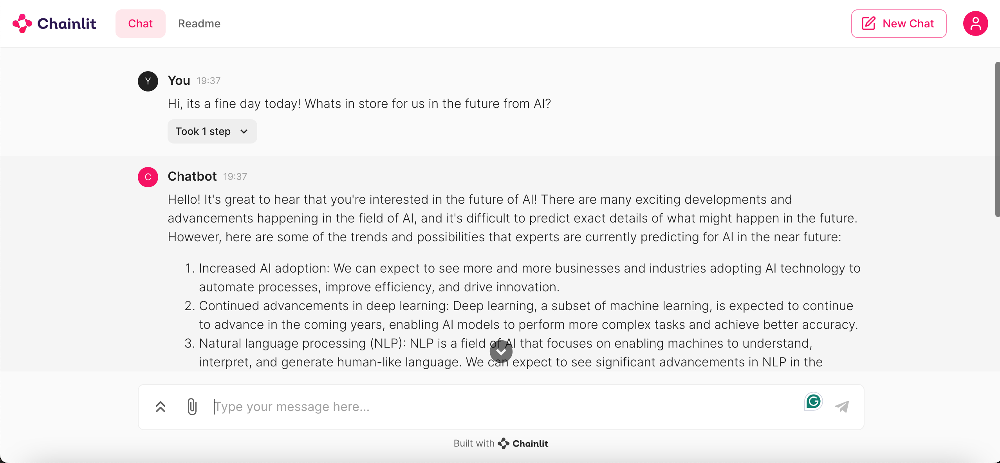

# Local Llama 2 Chatbot

This is a chatbot based on Llama 2 model by Meta AI. Chatbot's Graphical User Interface is developed using Chainlit.

## Overview

This chatbot is developed using following components

- Open source NousResearch/Llama-2-7b-chat-hf model: [Link](https://huggingface.co/NousResearch/Llama-2-7b-chat-hf)
- LangChain
- Transformers
- Chainlit

## Features

- Graphical User Interface for conversation (ChatGPT style)
- Deployable locally on a computer and accessible offline
- Llama 2 prompt template with added conversation history feature

## Prerequisites
Before running the chatbot, make sure you have following requirements installed

```console
# Install the required packages
pip install -r requirements.txt
```

## How to run locally
To run the application, open console/shell/terminal and type following command

```console
chainlit run chatbot.py -w --port 8080
```

## Screenshot



## Continued development

I would like to:

- Add google colab notebook link to run the chainlit gui using colab's hardware resources
- Add user authentication to the chatbot

## Author

- GitHub - [Raza Ali](https://github.com/razaali90)


